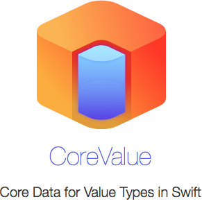

<p align="center">
<br/>
<a href="https://github.com/Carthage/Carthage"></a>
</p>


##Features

- Uses Swift Reflection to convert value types to NSManagedObjects
- iOS and Mac OS X support
- Use with `structs`
- Works fine with `let` and `var` based properties
- Swift 2.0

##Rationale

Swift introduced versatile value types into the iOS and Cocoa development domains. They're lightweight, fast, safe, enforce immutability and much more. However, as soon as the need for CoreData in a project manifests itself, we have to go back to reference types and `@objc`. 

CoreValue is a lightweight wrapper framework around Core Data. It takes care of `boxing` value types into Core Data objects and `unboxing` Core Data objects into value types. It also contains simple abstractions for easy querying, updating, saving, and deleting.

##Usage

The following struct supports boxing, unboxing, and keeping object state:

``` Swift
	struct Shop: NSManagedPersistentStruct {
	
	    // The name of the CoreData entity
	    static let EntityName = "Shop"
	    
	    // The ObjectID of the CoreData object we saved to or loaded from
	    var objectID: NSManagedObjectID?
	    
	    // Our properties
	    let name: String
	    var age: Int32
	    var owner: Owner?
	    
	    // Create a Value Type from a NSManagedObject
	    // If this looks too complex, see below for an explanation and alternatives
	    static func fromObject(o: NSManagedObject) -> Unboxed<Shop> {
	        return curry(self.init)
	            <^> o <|? "objectID"
	            <*> o <| "name"
	            <*> o <| "age"
	            <*> o <|? "owner"
	    }
	}
```


That's it. Everything else it automated from here. Here're some examples of what you can do with `Shop` then:


``` Swift
	// Get all shops (`[Shop]` is required for the type checker to get your intent!)
	let shops: [Shop] = Shop.query(self.context, predicate: nil)
	
	// Create a shop
	let aShop = Shop(name: "Household Wares", age: 30, owner: nil)
	
	// Store it as a managed object
	aShop.save(self.context)
	
	// Change the age
	aShop.age = 40
	
	// Update the managed object in the store
	aShop.save(self.context)
	
	// Delete the object
	aShop.delete(self.context)
	
	// Convert a managed object into a shop (see below)
	let nsShop: Shop? = Shop.fromObject(aNSManagedObject).value
	
	// Convert a shop into an nsmanagedobject
	let shopObj = nsShop.mutatingToObject(self.context)
	
```


## Querying

There're two ways of querying objects from Core Data into values:

``` Swift
// With Sort Descriptors
public static func query(context: NSManagedObjectContext, predicate: NSPredicate?, sortDescriptors: Array<NSSortDescriptor>) -> Array
    
// Without sort descriptors
public static func query(context: NSManagedObjectContext, predicate: NSPredicate?) -> Array

```

If no NSPredicate is given, all objects for the selected Entity are returned.

##Usage in Detail

`NSManagedPersistentStruct` is a type alias for the two primary protocols of CoreValue: `BoxingPersistentStruct`, `UnboxingStruct`.

Let's see what they do.

### BoxingPersistentStruct

Boxing is the process of taking a value type and returning a NSManagedObject. CoreValue really loves you and that's why it does all the hard work for you via Swift's `Reflection` feature. See for yourself:

``` Swift
struct Counter : BoxingStruct
    static let EntityName = "Counter"
	var count: Int
	let name: String
}
```

That's it. Your value type is now Core Data compliant. Just call `aCounter.toObject(context)` and you'll get a properly encoded `NSManagedObject`!

If you're interested, have a look at the `internalToObject` function in CoreValue.swift, which takes care of this.

#### Boxing in Detail

Keen observers will have noted that the structure above actually doesn't implement the `BoxingPersistentStruct` protocol, but instead something different called `BoxingStruct`, what's happening here?

By default, Value types are immutable, so even if you define a property as a var, you still can't change it from within except by declaring your function mutable. Swift also doesn't allow us to define properties in protocol extensions, so any state that we wish to assign on a value type has to be via specific properties on the value type.

When we create or load an NSManagedObject from Core Data, we need a way to store the connection to the original NSManagedObject in the value type. Otherwise, calling save again (say after updating the value type) would not update the NSManagedObject in question, but instead *insert a new NSManagedObject* into the store. That's obviously not what we want.

Since we cannot implicitly add any state whatsoever to a protocol, we have to do this explicitly. That's why there's a separate protocol for persistent storage:

``` Swift
struct Counter : BoxingPersistentStruct
    let EntityName = "Counter"
    
    var objectID: NSManagedObjectID?
    
	var count: Int
	let name: String
}
```

The main difference here is the addition of `objectID`. Once this property is there, `BoxingPersistentStruct`'s bag of wonders (.save, .delete, .mutatingToObject) can be used.

What's the usecase of the `BoxingStruct` protocol then, you may ask. The advantage is that `BoxingStruct` does not require your value type to be mutable, and does not extend it with any mutable functions by default, keeping it a truly immutable value type. It still can use `.toObject` to convert a value type into an NSManagedObject, however it can't modify this object afterwards. So it is still useful for all scenarios where you're only performing insertions (like a cache, or a log) or where any modifications are performed in bulk (delete all), or where updating will be performed on the NSManagedObject itself (.valueForKey, .save).

#### Boxing and Sub Properties

A word of advice: If you have value types in your value types, like:

``` Swift
struct Employee : BoxingPersistentStruct {
    let EntityName = "Employee"
    var objectID: NSManagedObjectID?
    let name: String
}

struct Shop : BoxingPersistentStruct {
    let EntityName = "Counter"
    var objectID: NSManagedObjectID?
    let employees: [Employee]
}
```

Then ***you have to make sure*** that all value types conform to the same boxing protocol, either `BoxingPersistentStruct` or `BoxingStruct`. The type checker cannot check this and report this as an error.

#### Ephemeral Objects

Most protocols in CoreValue mark the NSManagedObjectContext as an optional, which means that you don't have to supply it. Boxing will still work as expected, only the resulting NSManagedObjects will be ephemeral, that is, they're not bound to a context, they can't be stored. There're few use cases for this, but it is important to note that not supplying a NSManagedObjectContext will not result in an error.


### UnboxingStruct

In CoreValue, `boxed` refers to values in an NSManagedObject container. I.e. NSNumber is boxing an Int, NSOrderedSet an Array, and NSManagedObject itself is boxing a value type (i.e. `Shop`).

`UnboxingStruct` can be applied to any struct or class that you intend to initialize from a NSManagedObject. It only has one requirement that needs to be implemented, and that's `fromObject` which takes a NSManagedObject and should return a value type. Here's a very simple and unsafe example:

``` Swift
struct Counter : UnboxingStruct
	var count: Int
	let name: String
	static func fromObject(object: NSManagedObject) -> Unboxed<Counter> {
	return Unboxed.Success(Counter(count: object.valueForKey("count")!.integerValue,
           name: object.valueForKey("name") as? String!))
	}
}
```

Even though this example is not safe, we can observe several things from it. First, the implementation overhead is minimal. Second, we're not returning a Counter value, but instead the `Unboxed<Counter>` enum. That's because unboxing can fail in a multitude of ways (wrong value, no value, wrong entity, unknown entity, etc). If unboxing fails in any way, we should return `Unboxed.TypeMismatch(...)`. The other benefit of using `Unboxed` is, that it allows us to take an unboxing shortcut (which CoreValue deviously copied from [Argo](https://github.com/thoughtbot/Argo)). Utilizing several custom operators, the unboxing process can be greatly simplified:

``` Swift
struct Counter : UnboxingStruct
	var count: Int
	let name: String
	static func fromObject(object: NSManagedObject) -> Unboxed<Counter> {
		return curry(self.init) <^> object <| "count" <*> object <| "name"
	}
}
```

This code takes the automatic initializer, curries it and maps it over multiple incarnations of unboxing functions (`<|`) until it can return a Unboxed<Counter>. As a very neat side effect, if any of the unboxing operations fail, it will automatically return `Unboxed.TypeMismatch` and tell you specifically which decoding failed. Even better, all this is type checked, so if you accidentally try to decode an optional value into an array, the type checker will note it.

But what about these weird runes? Here's an in-detail overview of what's happening here:

#### Unboxing in Detail

`curry(self.init)`

Convert `(A, B) -> T` into `A -> B -> C` so that it can be called step by step

`<^>`
Map the following operations over the `A -> B -> fn` that we just created

`object <| "count"`
First operation: Take `object`, call `valueForKey` with the key `"count"` and assign this as the value for the first type of the curryed init function `A`

`<*>`
Apply on the curried self.init

`object <| "name"`
Second operation: Take `object`, call `valueForKey` with the key `"count"` and assign this as the value for the second type of the curryed init function `B`

#### Other Operators

Custom Operators are observed as a critical Swift feature, and rightly so. Too many of those make a codebase difficult to read and understand. The following custom operators are the same as in several other Swift Frameworks (see Runes and Argo). They're basically a verbatim copy from Haskell, so while that doesn't make them less custom or even official, they're at least unofficially agreed upon.

`<|` is not the only operator needed to encode objects. Here's a list of all supported operators:

           Operator                     | Description
:-----:|----------------------------------------------------------
 <^>   |  Map the following operations (always has to be the first op)
 <*>   |  Apply on the fn (use this to combine operations)
 <\|   |  Unbox a normal value (i.e. var shop: Shop)
 <\|\| |  Unbox a set/list of values (i.e. var shops: [Shops])
 <\|?  |  Unbox an optional value (i.e. var shop: Shop?)

### Unboxed

Finally, the Unboxed enum looks like this:

``` Swift
public enum Unboxed<T> {
    case Success(T)
    case TypeMismatch(String)
    
    public var value: T?
    }
```

You can pattern match for `.Success`, or try to unwrap `value` in order to retrieve the actually unboxed value type:

``` Swift
switch Shop.fromObject(managedObject) {
  case .Success(let value):
    print(value.name)
  case .TypeMismatch(let error):
    print(error)
}
```


### NSManagedStruct

Since most of the time you probably want boxing and unboxing functionality, CoreValue includes two handy type aliases, `NSManagedStruct` and `NSManagedPersistentStruct` which contain Boxing and Unboxing in one type.

## Docs
(Coming, have a look at [CoreValue.swift](https://github.com/terhechte/CoreValue/blob/master/CoreValue/CoreValue.swift), it's full of docstrings)

Alternatively, there's a lot of usage in the [Unit Tests](https://github.com/terhechte/CoreValue/blob/master/CoreValueMacTests/CoreValueTests.swift).

Meanwhile, here's a  more complex example of CoreValue in use:

``` Swift
struct Employee : NSManagedPersistentStruct {
    
    static let EntityName = "Employee"
    
    var objectID: NSManagedObjectID?

    let name: String
    var age: Int16
    let position: String?
    let department: String
    let job: String
    
    static func fromObject(o: NSManagedObject) -> Unboxed<Employee> {
        return curry(self.init)
            <^> o <| "objectID"
            <*> o <| "name"
            <*> o <| "age"
            <*> o <|? "position"
            <*> o <| "department"
            <*> o <| "job"
    }
}

struct Shop: NSManagedPersistentStruct {
    static let EntityName = "Shop"
    
    var objectID: NSManagedObjectID?

    var name: String
    var age: Int16
    var employees: [Employee]
    
    static func fromObject(o: NSManagedObject) -> Unboxed<Shop> {
        return curry(self.init)
            <^> o <| "objectID"
            <*> o <| "age"
            <*> o <| "name"
            <*> o <|| "employees"
    }
}

// One year has passed, update the age of our shops and employees by one
let shops: [Shop] = Shop.query(self.managedObjectContext, predicate: nil)
for shop in shops {
    shop.age += 1
    for employee in shop.employees {
        employee.age += 1
    }
    shop.save()
}

```

## State

All Core Data Datatypes are supported, with the following **exceptions**:
- Transformable
- Unordered Collections / NSSet (Currently, only ordered collections are supported)

Fetched properties are not supported yet.


## Installation (iOS and OSX)

### [Carthage]

[Carthage]: https://github.com/Carthage/Carthage

Add the following to your Cartfile:

```
github "terhechte/CoreValue" ~> 0.1
```

Then run `carthage update`.

Follow the current instructions in [Carthage's README][carthage-installation]
for up to date installation instructions.

[carthage-installation]: https://github.com/Carthage/Carthage#adding-frameworks-to-an-application

The `import CoreValue` directive is required in order to use CoreValue.


### Manually

1. Copy the CoreValue.swift and curry.swift file into your project.
2. Add the `Core Data` framework to your project

There is no need for `import CoreValue` when manually installing.


## Contact

Benedikt Terhechte 

[@terhechte](http://www.twitter.com/terhechte)

[Appventure.me](http://appventure.me)


## Acknoledgements

CoreValue uses ideas and code from [ThoughtBot's Argo framework for JSON encoding/decoding](https://github.com/thoughtbot/Argo). Most notably their `curry` implementation. Have a look at it, it is an awesome framework.

## License

The CoreValue source code is available under the MIT License.

## Open Tasks

- [ ] add thoughtbot curry framework https://github.com/thoughtbot/Curry
- [ ] add cocoapods pod (current state: https://github.com/CocoaPods/CocoaPods/issues/3829)
- [ ] simplify the reflection mechanism
- [x] add performance tests
- [ ] add travis build
- [ ] support aggregation
- [ ] add support for nsset / unordered lists
- [ ] add support for fetched properties (could be a struct a la (objects, predicate))
- [ ] support transformable: https://developer.apple.com/library/mac/documentation/Cocoa/Conceptual/CoreData/Articles/cdNSAttributes.html
- [ ] add jazzy for docs and update headers to have proper docs
- [ ] document multi threading support via objectID
- [ ] add fetchRequest support to batch get nsmanagedobjects for an array of value types in a quicker way
- [ ] add more unit tests and clean up the current incarnation

